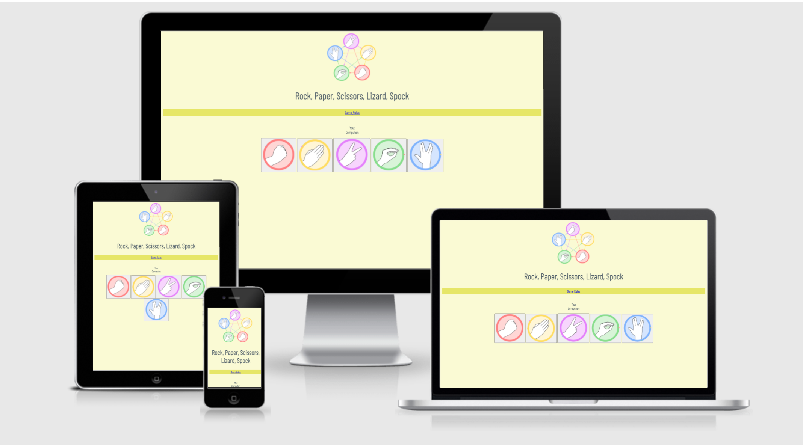
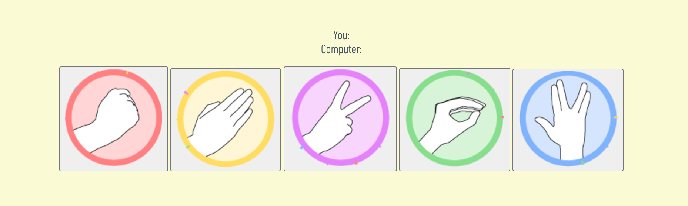
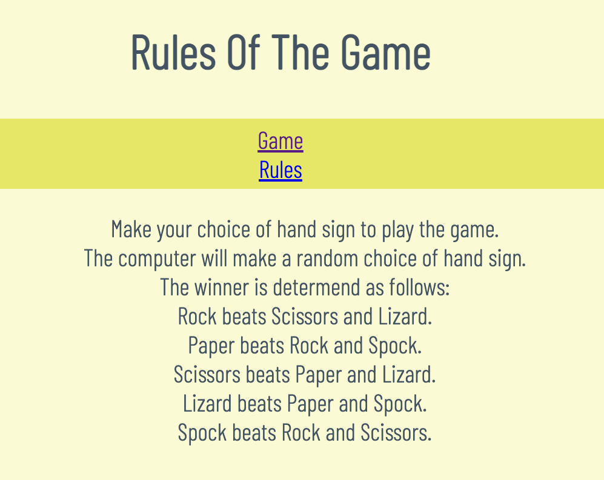
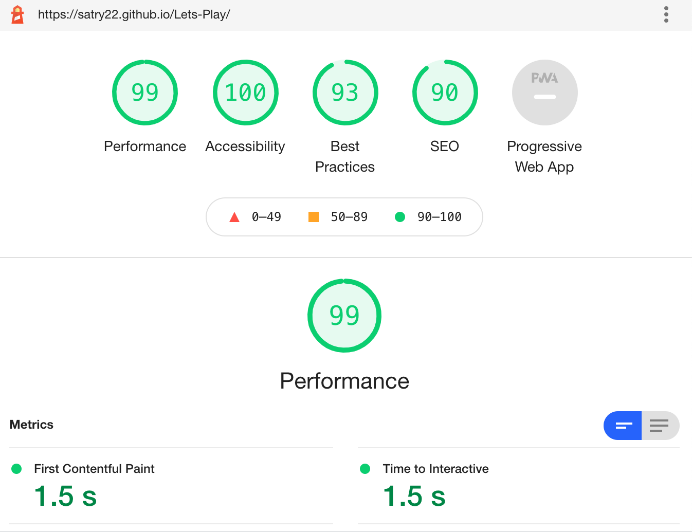

# Rock, Paper, Scissors, Lizard, Spock

Rock, Paper, Scissors, Lizard, Spock is a game that has been played for many years. This is an evolved version. The player plays the computers random choice.

The live link can be found here - https://satry22.github.io/Lets-Play/

## User Experience

- __Design__

  - The design is simplistic and uses colors to easier differentiate the different choice buttons. It has a small navigation menu and it is easy to go back and forth between the Game page and the Rules page.
  - The fonts are easy to read and contribute to a better user experience.

- __Visual Idea__
  - Wireframes were created by hand with pen and paper.
  - The ideas for the project came from Code Institute suggestion of a Rock, paper, Scissors game.

- __User Stories__

- As a user I want to know what the page is about.

- As a user I want to navigate between pages.

- As a user I want be able to easily understand what the game is and what are the rule.

- As a user I want to be able to see the scores kept during a game.

## Features 

- __Navigation Bar__

  - At the top of the pages, the responsive navigation bar includes links to the Game page, the Gallery and a Rules page. It is identical in each page to allow for easy navigation.
  - This section will allow the user to easily navigate between pages across all devices without having to revert back to the previous page via the ‘back’ button. 

- __The Header__

  - The main image is an icon, a visual display of the games and its rules. 
  - This section introduces the user to what the game is.

- __The Game Section__

  - The Game section features five buttons. Each button represent a hand sign to be chosen by the user, and that choice triggers the computer to make a random choice of hand sign.  
  - The Game section includes a counter to able the user to see how many wins and losses they have.

- __The Rules__

  - This section present rules of the game. The user will learn what actions are the winning actions, and what are thee losing action.

### Features Left to Implement

- A pop-up message with the declaration of the winner.
- An ability to choose number of times in a "Best of ? number of games".

## Technology

- Used for creating my project:
  - Google Chrome web browser
  - GitPod for developing the code
  - GitHub for deploying the project
  - HTML code
  - CSS for styling the UI.
  - JavaScript for buisness.
  - DevTools for testing and de-bugging the code

## Testing

### Validator Testing 

- HTML
  - No errors were returned when passing through the official [W3C validator](https://validator.w3.org/nu/?doc=https%3A%2F%2Fcode-institute-org.github.io%2Flove-running-2.0%2Findex.html)

- CSS
  - No errors were found when passing through the official [(Jigsaw) validator](https://jigsaw.w3.org/css-validator/validator?uri=https%3A%2F%2Fvalidator.w3.org%2Fnu%2F%3Fdoc%3Dhttps%253A%252F%252Fcode-institute-org.github.io%252Flove-running-2.0%252Findex.html&profile=css3svg&usermedium=all&warning=1&vextwarning=&lang=en#css)

- JSHint was run without errors. [JSHint](https://jshint.com/)

  - Performance tested in Lighthouse:

  

  - Tested for Iphone X, Ipad, Motola G4, Galaxy S5.

  - Supported screens: Google Chrome, Safari.
  

### User Stories Testing

- As a user I want to know what the page is about.
  The title and the main image immediately tells the user what the page and game is.

- As a user I want be able to easily understand what the game is and what the rules are.
  The main image and page title tells the user what the game. On the Rules page the rules are lined up. Klick 'Rules' in navigation bar and browse the rules.

  

- As a user I want to be able to see the scores kept during a game.
  The scores are centered in the page, just above the game buttons. Count is automatic and also displays the winner of the round.

  

- As a user I want to navigate between pages.
  Navigation links are right below the page title, centered in the page. Klick on 'Game' or 'Rules' in the navigation bar to navigate the pages.
  
  

### Unfixed Bugs

- No bugs unfixed. 

- I had a issue with my cards stacking up on each other instread of lining up next to one another. I solved the issue by turning my cards into buttons.

## Deployment

- To develope my project i opened repo in gitpod, first with the green button and then reopened the workspace from gitpod.io/workspaces.
Made changes to files and saved them
Did a `git add .`
Did a `git commit -m "message"`
Did a `git push` to push my work into GitHub.

- The site was deployed to GitHub pages. The steps to deploy are as follows: 
  - In the GitHub repository, navigate to the Settings tab 
  - From the source section drop-down menu, select the Main Branch
  - Once the main branch has been selected, the page will be automatically refreshed with a display to indicate the successful deployment. 

## Credits 

  - Google fonts Barlow Condensed was used on the entire page.
  - W3School has been used for instruction and ideas for the overall page.
  - Basic structure inspiration from other game-creators via Google search.
  - Tutorials and instruction from The Code Institute.

### Content 

- All content written by Sara Tryzell.

### Media

- Images taken from [Google](https://www.google.com):